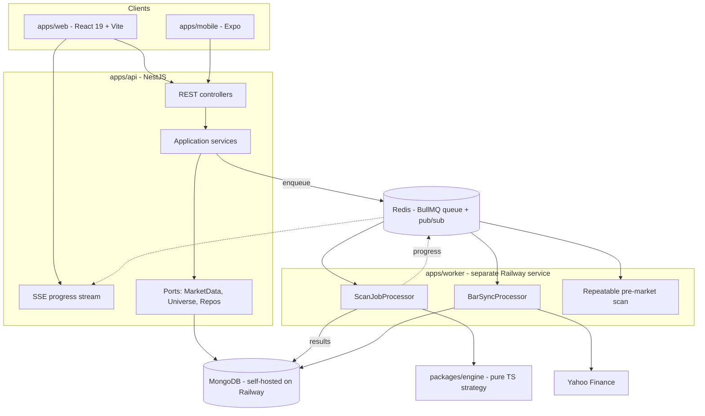

## Current state (what we are replacing)

- [headless_scanner.py](headless_scanner.py) (1578 lines) is simultaneously the Streamlit UI, the scan orchestrator, the thread pool manager and the progress renderer. `run_scan()` is the only clean seam.
- [sequence_vova.py](sequence_vova.py) (1388 lines) holds all hand-rolled math: ATR/EMA/SMA/MACD/DMI-ADX/Bollinger/Elder plus the sequence state machine and HH/LH/DT/HL/LL/DB structure labelling. No TA-Lib.
- [chart_preview.py](chart_preview.py) builds a Plotly candlestick with critical-level step lines, extension lines, structure markers, fib levels and a multi-timeframe watermark from [watermark_status.py](watermark_status.py).
- State lives entirely in `st.session_state`; nothing persists. Ticker universes are flat files (`EXCHANGE:SYMBOL|Company Name`) in [STOCK-TICKERS.txt](STOCK-TICKERS.txt) / [TV-LIST-ETF.txt](TV-LIST-ETF.txt). There is no authentication.
- A scan of ~2300 symbols runs synchronously inside one Streamlit rerun, hammering Yahoo Finance with 4 download threads + 16 TA threads, with a low-memory streaming mode bolted on ([scan_memory.py](scan_memory.py)).
- **Key asset:** [mobile/](mobile) already contains a working Expo app with a TypeScript port of the engine ([mobile/src/engine/sequenceVova.ts](mobile/src/engine/sequenceVova.ts), [mobile/src/engine/dataUtils.ts](mobile/src/engine/dataUtils.ts)), a Yahoo client ([mobile/src/yahoo/client.ts](mobile/src/yahoo/client.ts)), a scan orchestrator ([mobile/src/scan/runScan.ts](mobile/src/scan/runScan.ts)), a SQLite journal whose schema maps cleanly to Mongo ([mobile/src/db/journal.ts](mobile/src/db/journal.ts)), and a Python-vs-TS parity harness ([mobile/scripts/check_parity.ts](mobile/scripts/check_parity.ts)).

The refactor therefore is not a from-scratch rewrite: it promotes the existing TS engine into a shared package and builds a real backend and web client around it.

## Target architecture



The decisive structural change: **scans stop being request-scoped**. A scan becomes a persisted `ScanRun` document processed by a separate worker service, with progress published over Redis and relayed to the browser via SSE. This removes the low-memory hacks, makes runs resumable and cancellable, and gives run history for free.

The second decisive change: **MongoDB becomes the market-data cache**. A `BarSync` job keeps bar series current incrementally; scans read bars from Mongo instead of calling Yahoo ~2300 times per run. This is what makes a large scan fast and removes the rate-limit fragility that today forces retries and backoff in [headless_scanner.py](headless_scanner.py).

The third change, which only a paid worker makes possible: **scans become scheduled**. A repeatable BullMQ job runs the full universe after the US close so results are waiting before the open, instead of the operator pressing START and watching a progress bar. This is the largest single product improvement over the current app and its marginal compute cost is a few cents a month.

The API and worker must stay **separate services**. The scan is a CPU-bound loop; running it in the API process would block Node's event loop and freeze SSE and HTTP for the duration.

## Monorepo layout

pnpm workspaces + Turborepo, TypeScript strict everywhere.

```
apps/
  api/       NestJS 11 REST + SSE
  worker/    Node process running BullMQ processors, shares api's domain modules
  web/       React 19 + Vite 7 SPA
  mobile/    existing Expo app, moved here, engine deps swapped for @vova/engine
packages/
  engine/    @vova/engine    pure functions, zero I/O, zero framework
  contracts/ @vova/contracts Zod schemas -> DTOs + OpenAPI + client types
  charts/    @vova/charts    Lightweight Charts primitives + React chart components
  ui/        @vova/ui        Tailwind v4 + shadcn/ui design system
legacy/      current Python app, retained as parity oracle
```

## Is TypeScript the right engine language? (honest assessment)

Recommendation: **yes, but for specific reasons, not generic ones.**

Arguments for:

- A parity-tested TS port of the state machine already exists ([mobile/src/engine/sequenceVova.ts](mobile/src/engine/sequenceVova.ts), 632 lines) with a fixture-based harness ([mobile/scripts/check_parity.ts](mobile/scripts/check_parity.ts)). Choosing Python for the server would mean maintaining two engine implementations permanently, because the mobile app scans on-device and offline.
- The workload is a **scalar loop over bars per symbol**, not matrix algebra. `pinePython` in [sequence_vova.py](sequence_vova.py) is a bar-by-bar loop that the code already had to accelerate with `numba` precisely because pandas cannot vectorise it. That kind of loop over typed arrays is exactly what V8 JITs well, so Python's numeric advantage largely evaporates here.
- One language across web, mobile, server and the shared Zod contracts.

Honest arguments against, and the mitigations:

- **Porting risk is the real cost.** Roughly 700 lines of chart-side math in [sequence_vova.py](sequence_vova.py) (MACD, DMI/ADX, Bollinger, Elder envelope/impulse, peak/trough labelling, fib, extension lines) plus the pandas resampling in [data_utils.py](data_utils.py) are not yet ported. Every ported line is a chance to silently break TradingView parity. Mitigation: keep Python in `legacy/` permanently as the oracle and make the golden-fixture parity suite a blocking CI gate — not a one-off migration check.
- **Python wins if the roadmap turns quantitative.** Backtesting sweeps, walk-forward optimisation or ML feature work have no real TS equivalent to pandas/vectorbt/statsmodels. Mitigation: this is additive, not a reversal — a Python analytics sidecar can read bar series straight out of MongoDB later without touching the web stack.

## Is MongoDB the right database? (honest assessment)

Recommendation: **yes, with one important correction to the bar storage model.**

Where Mongo is genuinely the better fit:

- The yfinance `.info` payloads cached in [ticker_data.py](ticker_data.py) have a wide, unstable, provider-defined shape. Storing them as documents avoids either a migration per field or a JSON column pretending to be relational.
- BUY rows and SELL rows are different shapes (`TP/SL/RR/Strong` versus `Entry/Exit/P&L`), and a future second strategy will add a third. A `signals` collection with a discriminated payload models that directly.
- The engine never queries individual bars. It always wants *the whole series* for one symbol and interval. So the natural storage unit is the series, which a document store holds better than a row table.

**Correction to an earlier draft of this design:** it originally proposed a MongoDB *time-series collection* with one document per bar. Storing **one document per `(symbol, interval)` holding the series as compact binary column arrays** is better. For ~3,150 instruments across daily/weekly/monthly, per-bar documents mean roughly 3.6M documents and a mandatory `_id` index of comparable size to the payload; the column-array model holds the same data in tens of megabytes and turns the scan hot path into one document read per symbol instead of ~500 row reads. With a paid database the storage argument is secondary, but the read-amplification argument stands on its own: it is the difference between ~3,000 and ~1.5M document reads per full-universe scan. The accepted trade-off is that individual bars are not server-queryable and appending a bar means decode-append-encode; neither matters, because the engine always consumes whole series and `BarSync` touches each series once a day.

Where Mongo is merely adequate: `trades` and monthly P&L are relational-shaped work. That is fine — the volume is tiny and `$group` handles the reporting — but it is not a point in Mongo's favour.

Mongo must be configured as a **single-node replica set**, not a standalone `mongod`, both locally and on Railway. Multi-document transactions and change streams both require it, and the default container templates usually do not enable it.

The credible alternative, to be written up as an ADR rather than dismissed: **Postgres with JSONB** would handle the fundamentals blobs adequately and give real constraints on `trades`. It costs the same to self-host on Railway, so this is purely a data-shape judgement rather than a cost one. Mongo still wins on the heterogeneous signal payloads and schema-free provider data, but the margin is narrower than a free-tier framing would suggest.

## Stack choices and rationale

- **Backend: NestJS + Mongoose.** NestJS's module/DI model is what makes the ports-and-adapters layering below enforceable rather than aspirational, and it gives first-class SSE and validation pipes. Mongoose over Prisma for better access to aggregation pipelines and BSON binary handling.
- **Web: React 19 + Vite + TanStack Router/Query/Table.** TanStack Table with virtualization replaces `st.dataframe` for large result grids, Query owns all server state, Zustand holds only ephemeral UI state. Forms via react-hook-form + the Zod schemas from `@vova/contracts`, so the scan config validates identically on client and server.
- **Design system: Tailwind v4 + shadcn/ui (Radix).** Accessible primitives, and the existing terminal-dark palette (`#050505` app, `#1e222d`/`#2a2e39` surfaces, `#2962ff` accent, `#089981`/`#f23645` candles) becomes design tokens instead of the string-concatenated CSS in [ui_styles.py](ui_styles.py).
- **Price charts: TradingView Lightweight Charts v5** wrapped in `@vova/charts`. It is the right fidelity/performance match for candles and already matches the app's visual language. The Plotly-specific tricks map onto v5 features: the `shape="hv"` critical level becomes a stepped line series split by `seq_state`; HH/LH/DT/HL/LL/DB become series markers; TP/SL/fib become price lines; extension lines become a custom series primitive. Weekend gaps come free, so the Plotly `rangebreaks` hack disappears. Licence note: Apache-2.0 and free, but its NOTICE requires the TradingView attribution to stay visible on the chart — a condition to honour, not a cost. `react-plotly.js` stays available as a fallback if any overlay proves impractical.
- **Analytics charts: Recharts** for equity curve, monthly P&L and win-rate panels — a separate concern from price charts, so a separate lighter library is correct.
- **Jobs: BullMQ on a self-hosted Redis service.** Gives retries with backoff, lease/stall recovery, concurrency limits, a built-in rate limiter to replace the hand-rolled 12 req/s token bucket in [headless_scanner.py](headless_scanner.py), repeatable cron jobs for the pre-market scan and nightly `BarSync`, and pub/sub for progress without polling. On Railway a Redis container idles at tens of megabytes, so this costs well under a dollar a month — cheap enough that hand-rolling lease and retry semantics on top of Mongo would be false economy. Queued state is also mirrored into `scanRuns`, so losing Redis loses scheduling, never history.
- **Auth: better-auth or Lucia, self-hosted against the `users` collection.** Deliberately not Clerk/Auth0 — their free tiers add an external dependency and MAU ceiling for what is a single-operator tool.
- **Quality: Vitest, Playwright, Biome, pino.** OpenTelemetry wiring is designed for but left disabled by default, since a collector is another dependency to pay for and operate.

## Design patterns, applied where they earn their place

- **Hexagonal / ports-and-adapters** in `apps/api`: `MarketDataPort` (adapters: `YahooMarketDataAdapter`, `MongoBarCacheAdapter`, `FixtureAdapter` for tests), `UniversePort` (adapters: `MongoUniverseAdapter`, `LegacyTextFileAdapter` for the one-time import), `ScanRunRepository`, `TradeRepository`. Domain and engine never import Mongoose or `fetch`.
- **Strategy + Registry** for scanners. The code already carries a `scanner_id` field pinned to `"sequence_vova"`; formalise it as a `ScannerStrategy` interface (`describeParams`, `evaluateLast`, `evaluateHistory`) resolved from a registry, so a second strategy is an added file rather than an edited `if`.
- **Repository** for every collection, returning domain objects, never Mongoose documents.
- **Builder** for chart overlay composition, replacing the 800-line procedural `build_sequence_vova_figure`: each overlay (candles, structure markers, critical level, fib, BB, EMA, TP/SL, watermark) is an independently testable `OverlayContributor`.
- **Result / Either** for scan outcomes. The Python code signals rejection through `explain_invalid_buy()` reason strings; make that a discriminated union (`{ status: 'rejected', reason: RejectReason }`) so reject codes are exhaustive and typed instead of stringly.
- **Observer** for progress: worker publishes `ScanProgressEvent`s, API relays via SSE, client subscribes. Replaces Streamlit's rerun-driven progress bars.
- **Command/handler split (CQRS-lite)**: `StartScanCommand` enqueues and returns a run id immediately; reads go through query services backed by aggregation pipelines.
- **Adapter** for symbol mapping (Yahoo suffixes `.TO`/`.V`/`.NE`/`.CN` to TradingView `EXCHANGE:SYMBOL`), lifted from [tradingview_embed.py](tradingview_embed.py) and [mobile/src/tickers/lists.ts](mobile/src/tickers/lists.ts).

## MongoDB data model

Collections, with the indexes that matter:

- `users` — email, hashed password, roles. Unique index on email. (New capability; the app currently has no auth at all.)
- `instruments` — replaces the two text files. `{ yahooTicker, tvSymbol, exchange, companyName, assetType, universes: string[], active }`. Unique on `yahooTicker`; index on `universes`.
- `barSeries` — **one document per `(yahooTicker, interval)`**, not per bar. Shape: `{ yahooTicker, interval, firstDate, lastDate, barCount, dates: BinData, open: BinData, high: BinData, low: BinData, close: BinData, volume: BinData, updatedAt }`, where each `BinData` is a packed typed array (Float32 for prices, Int32 day-offsets for dates) optionally deflated. Unique compound index on `{ yahooTicker, interval }`. This is the cache that decouples scans from Yahoo, and the single-document-read shape is what keeps a full-universe scan fast. `@vova/engine` gets `encodeSeries`/`decodeSeries` helpers so the packing format lives in one tested place.
- `instrumentFundamentals` — market cap, PE, earnings date, description; **TTL index** on `fetchedAt` (24h), replacing the `.cache/yf_info/*.json` file cache.
- `scanRuns` — params snapshot, status (`queued|running|completed|cancelled|failed`), `asOf`, counters, timings, `ownerId`. Index on `{ ownerId, createdAt: -1 }`. Direct successor to the SQLite `scan_runs` table.
- `signals` — one document per emitted row, embedding the typed BUY or SELL payload plus a bar snapshot for chart rendering. Index on `{ runId, symbol }`.
- `trades` — successor to the SQLite `trades` table (entry/tp/sl/shares/status/exit/pnl), enabling the mobile-only journal, history and monthly P&L features on web too. Index on `{ ownerId, status, symbol }`.
- `scanPresets` / `chartPresets` — persisted `IndicatorParams` from [indicator_params.py](indicator_params.py), so chart settings survive sessions instead of dying with `st.session_state.chart_params`.

Every schema is defined once as a Zod schema in `@vova/contracts` and derived into both the Mongoose schema and the API DTOs, so drift is impossible.

## API surface (sketch)

- `POST /api/scans` — validate params, enqueue, return `{ runId }`.
- `GET /api/scans/:id` / `GET /api/scans` — run detail and paginated history.
- `GET /api/scans/:id/events` — SSE progress stream (phase, percent, counters).
- `POST /api/scans/:id/cancel` — sets a cancellation flag the worker polls, mirroring today's `is_cancelled` callback.
- `GET /api/scans/:id/signals` — server-side paginated, sorted, filtered rows for the grid.
- `GET /api/instruments/:ticker/chart?tf=` — bars plus computed overlay series.
- `GET /api/instruments/:ticker/status` — the multi-timeframe watermark payload from [watermark_status.py](watermark_status.py).
- `GET/POST /api/trades`, `POST /api/trades/:id/close`, `GET /api/reports/monthly`.
- `GET/PUT /api/presets/{scan,chart}`.

## Budget: Railway, target under $250/year

No framework or database licence is paid for. Every library in the stack is permissively licensed: React, Vite, TanStack, Tailwind, shadcn/ui + Radix, Recharts, NestJS, Mongoose, Zod, BullMQ, Vitest, Playwright, Biome, pino, react-hook-form, Expo, better-auth/Lucia, and Lightweight Charts (Apache-2.0, attribution must stay visible on the chart). MongoDB and Redis are self-hosted from their own community images, so the spend is compute, not licence.

**Railway Hobby, $5/month with the first $5 of usage included.** Metered rates are $10/GB-month of RAM, $20/vCPU-month of CPU, $0.15/GB-month of volume and $0.05/GB of egress, all billed per second on *actual* consumption — so idle services are genuinely cheap and the CPU bursts a scan produces are measured in cents. Hobby allows 6 replicas and caps volumes at 5 GB per service, which is far above what the `barSeries` model needs.

Planned footprint, four Railway services in one project on the private network:

- `api` — NestJS, idles near 200 MB with negligible CPU, roughly $2.50/month.
- `worker` — idles near 120 MB; a three-minute full-universe scan at 1.5 vCPU costs a fraction of a cent, so even a daily scheduled scan stays under $0.10/month. Roughly $1.50/month.
- `mongo` — community image configured as a single-node replica set, WiredTiger cache capped explicitly so it settles near 400 MB, plus a small volume. Roughly $5/month.
- `redis` — BullMQ broker, tens of megabytes with a small AOF volume. Under $0.50/month.

Web assets go to **Cloudflare Pages** rather than a fifth Railway service: static hosting is free there and it saves both the compute and the egress. Backups are a scheduled `mongodump` to Cloudflare R2, whose free allowance covers a dump measured in tens of megabytes; this is the deliberate mitigation for self-hosting rather than using a managed cluster.

That lands around **$9-10/month, roughly $115/year**, plus about $12/year for a domain. Against a $250 ceiling that leaves close to half the budget unspent, which is the point: the headroom is the contingency, not a target to fill.

Two cost decisions worth stating explicitly:

- **Self-hosted Mongo on Railway over Atlas Flex.** Flex starts at $8/month and scales by operations per second toward a $30 cap, so a heavy scan writing thousands of signals can push it above the base tier. Self-hosting on Railway is cheaper, has no operations-per-second tiering, sits on the same private network as the API and worker (so inter-service traffic is not billed as egress), and has no storage ceiling to design around. The thing Flex would buy is managed backups, which the R2 dump replaces for a workload where losing a day of bar cache is a re-sync, not a loss.
- **Stay on Hobby, not Pro.** Pro is $20/month, which alone is $240/year and would consume the entire budget for team features this project does not need.

Deliberately *not* spending the budget on market data. Tiingo at about $10/month or EODHD at about $20/month would eat most or all of the remaining headroom, and neither cleanly replaces Yahoo here: the universe includes TSX/TSXV/NEO/CSE listings that cheap US-only feeds do not cover, and parity was established against Yahoo's unadjusted series. The real fix for Yahoo's fragility is the `barSeries` cache, which turns per-scan fetching into one incremental sync per symbol per day and costs nothing. `MarketDataPort` keeps the swap to a paid provider a single adapter if Yahoo ever blocks in earnest, and the unspent headroom is what would fund it.

What the budget buys that free hosting could not: an always-on worker with no cold start and no runner queue latency, scheduled pre-market scans as the primary workflow instead of a manual START button, a database with no storage ceiling or operations tiering, and a real queue with retries and backoff instead of hand-rolled lease logic. Push notifications for new signals are free on both Expo and web push, so they ride along at no cost.

A local Docker Compose stack (`api`, `worker`, `web`, `mongo` as a single-node replica set, `redis`) remains part of the design as the development environment and as a zero-cost fallback, mirroring the Railway topology exactly.

## Web app screens

Replaces one Streamlit page with a routed app: **Scan** (config panel + live progress + virtualized results grid + chart detail pane), **Run History**, **Trade Journal**, **Reports**, **Universes**, **Settings**. Chart settings become a persisted preset panel rather than an expander, and the "Rejected/Skipped" expanders become a diagnostics drawer with typed reason codes.

## Migration phases

1. **Scaffold + parity gate.** Stand up the monorepo, move `mobile/` in, extract `packages/engine`. Extend [scripts/export_parity_fixture.py](scripts/export_parity_fixture.py) to emit a multi-symbol, multi-timeframe golden fixture set, and make the Vitest parity suite a CI gate. Python moves to `legacy/` and becomes the oracle, not the product.
2. **Engine completion.** The current TS port covers the screener path and a structure-overlay subset (`runStructureOverlay`). Port the remaining chart math from [sequence_vova.py](sequence_vova.py): MACD, DMI/ADX, Bollinger, Elder envelope and impulse, SMA major, peak/trough labelling, fib levels, extension lines, and the multi-timeframe watermark aggregation.
3. **API + persistence.** NestJS modules, Mongoose schemas, repositories, universe import from the text files, the `barSeries` encoder plus BarSync job, the BullMQ queue with its repeatable pre-market job, and SSE progress. Local Compose stack first, so nothing is billed until it works.
4. **Web client.** Design system, scan flow, results grid, chart package, then journal/reports.
5. **Deploy to Railway.** Four services on the private network, Cloudflare Pages for the web build, `mongodump` to R2 on a schedule, then a week of measured billing to confirm the cost model against the estimate before going further.
6. **Mobile convergence.** Point Expo at `@vova/engine` and optionally the API, keeping on-device scanning as an offline mode. Migrate the SQLite journal to the server with the local DB as cache.
7. **Cutover.** Run both apps side by side against the parity suite, then retire Streamlit.

## Deliverable of this task

Since the request is for a design, the output is a reviewable document set under `docs/`, not application code:

- `docs/architecture/README.md` — overview, C4-style context/container diagrams, module boundaries.
- `docs/architecture/adr/` — one ADR per decision, each with context, options considered and consequences: TypeScript engine over a Python service; MongoDB over Postgres+JSONB; `barSeries` binary columns over per-bar documents; self-hosted Mongo on Railway over Atlas Flex; BullMQ + Redis over a hand-rolled Mongo job document; Lightweight Charts over Plotly; NestJS + Mongoose; pnpm/Turborepo monorepo; Vite SPA over Next.js; Railway topology and the decision to keep Yahoo rather than buy market data.
- `docs/architecture/data-model.md` — collections, JSON Schema/Zod definitions, indexes, TTLs, the binary series encoding with its read-amplification math, and migration mapping from the text files and the mobile SQLite journal.
- `docs/architecture/api.md` — endpoint contracts and the SSE event schema.
- `docs/architecture/engine-parity.md` — the full inventory of indicators/state-machine rules to port, with source line references and the parity test strategy.
- `docs/architecture/frontend.md` — routes, component tree, state ownership, design tokens, chart overlay-to-primitive mapping.
- `docs/architecture/hosting-and-cost.md` — the Railway service topology, per-service memory and CPU estimates against the published rates, the annual total against the $250 ceiling, a per-dependency licence audit, the backup strategy, and the cost alarms plus the trigger conditions that would justify spending the remaining headroom.
- `docs/architecture/migration.md` — the phased plan with per-phase exit criteria and rollback.
- `docs/architecture/repo-layout.md` — target tree, package boundaries, dependency rules (enforced via Biome/lint import rules).

## Remaining close calls, documented rather than silently picked

- **Vite SPA vs Next.js 15** — recommending the Vite SPA: the API is standalone and shared with mobile, there is no SEO surface behind auth, and a static build costs nothing on Cloudflare Pages whereas Next.js server rendering would want a fifth billed service.
- **Self-hosted Mongo vs Atlas Flex** — recommending self-hosted on Railway for cost, private networking and no operations-per-second tiering, with the `mongodump`-to-R2 job as the price of giving up managed backups. Reversible quickly if operating it becomes a nuisance, since the connection string is the only thing that changes.
- **Merging `api` and `worker` into one service** — rejected, and worth recording why: it would save around $1.50/month, but the scan is a CPU-bound loop that would block Node's event loop and freeze SSE and HTTP while running. Not a saving worth making.

## Cost guardrails to build in from the start

Because the budget is a real ceiling rather than a guess, the design includes the means to defend it: a Railway usage alert set below the monthly target, an explicit WiredTiger cache cap on the Mongo container so memory does not drift upward with the host, TTL indexes on `instrumentFundamentals` and a retention policy on old `scanRuns`/`signals` so storage does not grow without bound, and a hard cap on scan concurrency so a runaway loop cannot bill CPU indefinitely. All four are cheap to add up front and awkward to retrofit.
