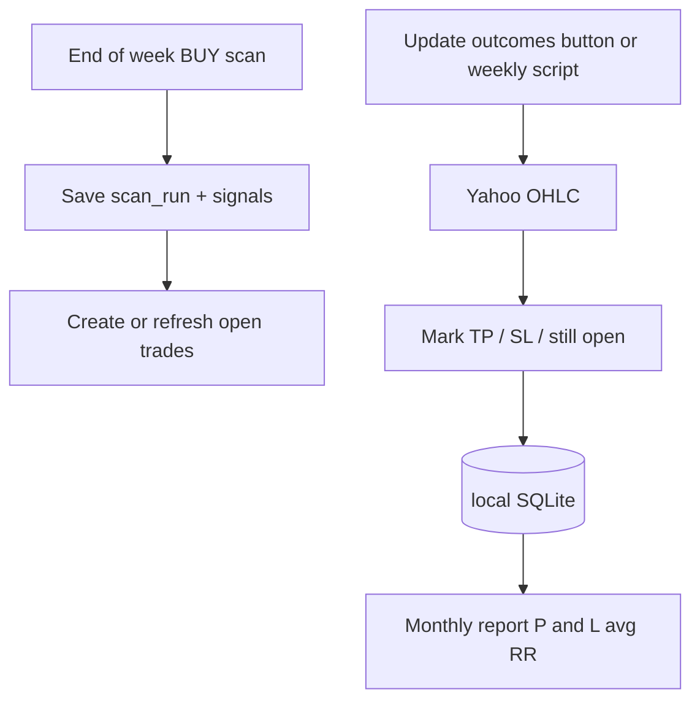

# Streamlit local scan journal and monthly P&L

## Overview

Extend the existing Streamlit Vova Screener with local SQLite persistence so weekly/monthly scans are saved, open trades are updated against later prices (TP/SL/P&L), and a monthly report shows open/closed trades with P&L and average RR — all on your Windows PC, no Expo/Mac/paid Apple ID, no app cloud.

## Why this is the easy path

Requirements (remember weekly/monthly scans, update trade results over time, monthly open/closed P&L + avg RR) are **analytics + persistence**. That is much easier in the existing Python app than building Expo Go:

- Engine, Yahoo fetch, BUY/SELL scans, and UI already exist (`headless_scanner.py`, `sequence_vova.py`).
- Add SQLite + a History/Trades/Report UI — no React Native port, no Mac, no Expo Go.
- PC must be on to use it (including from iPhone browser on LAN). Data lives in a local folder on the PC, not Streamlit Cloud.

**Locked approach:** enhance Streamlit locally. Expo iPhone app is deferred.

## What “remember and analyze” means (detailed)

### A. Scan archive (every weekly/monthly run)

Each time you press START (or a dedicated “Save this scan”):

- Store a **scan run**: timestamp, timeframe (`1W` / `1M` / `1D`), direction, source, min RR, risk $, params.
- Store every **signal row** (Symbol, Entry=Close, TP, SL, RR, shares, New/Strong, as-of bar date).
- Keep past runs forever locally — not only the last `st.session_state.results` (today’s behavior).

### B. Trade book (for P&L over time)

A scan hit is not yet a finished trade. Model:

| Entity | Role |
|--------|------|
| `scan_runs` | Snapshot of a screener run |
| `signals` | Rows inside that run |
| `trades` | Actionable journal entries (usually from BUY **New** / **Strong**) |
| `trade_updates` | Each outcome refresh (optional audit) |

**Opening a trade** (default rule for MVP):

- When a weekly (or monthly) BUY scan finishes, auto-journal signals that are **New** (and optionally Strong-only toggle).
- Fields at open: symbol, timeframe, opened_at / as_of, entry, tp, sl, rr_at_entry, shares, risk_usd, status=`open`.
- Deduplicate: if same symbol+timeframe already `open`, do not open a second trade; attach a note that it reappeared on the new scan.

**Updating results** (“every end of each week”):

- User clicks **Update open trades** (primary), and/or runs a small CLI script via Windows Task Scheduler.
- For each `open` trade, fetch OHLC after `as_of` (same Yahoo path as today).
- Intrabar rule: if `low <= SL` before `high >= TP` → close as **SL**; if TP first → **TP**; else stay **open**.
- On close: set `exit_price`, `exit_date`, `exit_reason`, `pnl_usd = (exit - entry) * shares`, `pnl_r = (exit - entry) / (entry - sl)` (sign-aware for longs).
- Manual close allowed (user sets exit price/date) for discretion.

SELL TO CLOSE in the current app is a **same-bar exit simulation**, not a multi-week journal. MVP trade book focuses on **BUY TO OPEN** signals held across weeks; SELL scan can still be archived as a scan snapshot without feeding the trade book.

### C. Monthly report

New sidebar/page **Reports → Monthly**:

- Pick calendar month.
- Sections:
  - **Closed this month**: table + totals (count, win rate, sum P&L $, avg P&L R, avg RR at entry).
  - **Still open** (as of report date): count, unrealized P&L vs last close, avg RR at entry.
  - **Opened this month** (optional third block).
- Export: CSV download of the month’s trades (local file, no cloud).

Formulas (longs):

- `pnl_usd = (exit_price - entry) * shares`
- `pnl_r = (exit_price - entry) / (entry - sl)` when SL below entry
- `avg_rr` = mean of `rr_at_entry` over the filtered set
- Win = `pnl_usd > 0` (or exit_reason == TP)

## Storage (local only)

- Path: `data/vova_journal.sqlite` under the repo (gitignored).
- New module `scan_journal.py`: schema init, save_scan_run, list_runs, upsert_trades_from_signals, update_open_trades, monthly_stats.
- No Streamlit Community Cloud dependency; document “run on Windows PC” only.
- Optional: keep last N OHLC caches on disk to speed weekly updates.

## UI changes in `headless_scanner.py`

1. After a successful scan: auto-save run + offer “Journal New signals as trades”.
2. New nav section (tabs or sidebar pages):
   - **Scan** (existing)
   - **History** — past runs, open a run’s table
   - **Trades** — open/closed list, Update button, manual close
   - **Monthly report** — month picker + summary + tables + CSV
3. Show last-updated time for outcomes so the weekly ritual is obvious.

## Weekly / monthly ritual (how you use it)

**End of week (Weekly TF):**

1. Set timeframe Weekly → START scan → auto-saved.
2. Journal New signals (auto or one click).
3. Click **Update open trades** → TP/SL/open refreshed; P&L filled for closes.

**End of month:**

1. Same with Monthly TF if you use it.
2. Open **Monthly report** → review closed + open → download CSV if needed.

**Automation (optional, still local):** `scripts/update_trade_outcomes.py` callable from Windows Task Scheduler Sunday evening — no cloud cron.

## Explicit non-goals (this phase)

- Expo / iPhone standalone / Expo Go.
- Streamlit Community Cloud hosting of the journal.
- Fully automatic trading or broker sync.
- Perfect intrabar TP-vs-SL when both hit same bar (document SL-first default; same as typical conservative assumption).

## Implementation order

1. SQLite schema + `scan_journal.py` (save/load runs, signals, trades).
2. Hook save into end of `run_scan` / results path in `headless_scanner.py`.
3. History UI.
4. Trade open + Update outcomes (Yahoo walk).
5. Monthly report + CSV.
6. Optional CLI updater + short note in `JOURNAL.md` (Windows run + weekly ritual).
7. `.gitignore` `data/`.

## Implementation todos

- [ ] Add `scan_journal.py` + SQLite schema (`scan_runs`, `signals`, `trades`) under `data/`
- [ ] Auto-save each completed scan from `headless_scanner` into the journal
- [ ] History UI to browse past weekly/monthly scan runs
- [ ] Journal New BUY signals; Update open trades via Yahoo TP/SL resolution
- [ ] Monthly report: open/closed, P&L, avg RR, win rate, CSV export
- [ ] Optional `scripts/update_trade_outcomes.py` + `JOURNAL.md` ritual notes; gitignore `data/`
