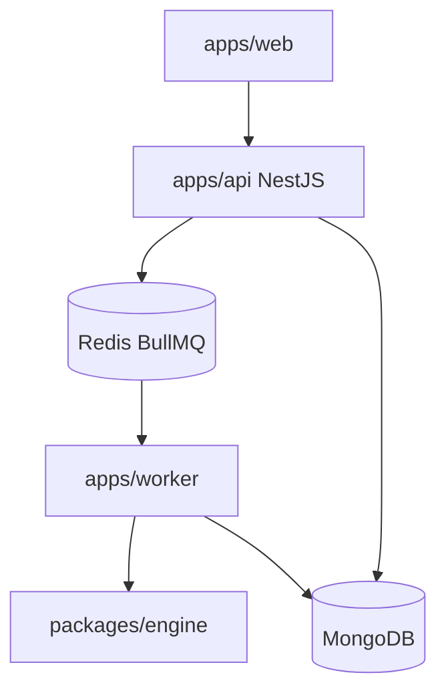

# Sequence Vova — architecture

Phased refactor of the Streamlit screener into a TypeScript monorepo.

## Status

| Layer | Status |
|-------|--------|
| Streamlit Community Cloud | **Production** until Railway cutover |
| `apps/web` React mobile-first SPA | Local scaffold (this repo) |
| `packages/engine` | Salvaged from former `mobile/` |
| NestJS API + worker + Mongo | Planned (not scaffolded yet) |
| Expo / standalone app | **Out of scope** — removed from design |

## Clients

Single client: **`apps/web`** (React 19 + Vite). Phone layout is canonical; desktop is progressive enhancement. No Expo.

## Runtime (target)



Until cutover, operators keep using Streamlit. React+Railway is a parallel candidate.

## Documents

- [repo-layout.md](repo-layout.md)
- [data-model.md](data-model.md)
- [api.md](api.md)
- [frontend.md](frontend.md)
- [engine-parity.md](engine-parity.md)
- [hosting-and-cost.md](hosting-and-cost.md)
- [home-server.md](home-server.md) — always-on PC + Cloudflare Tunnel (no Railway)
- [railway.md](railway.md) — Nest API on Railway (Dockerfile + Mongo)
- [migration.md](migration.md)
- [adr/](adr/) — architecture decision records

## Local commands

```bash
npm install
npm run dev:web    # http://localhost:5173 (also LAN via --host)
npm run parity     # TS vs Python fixture
```

Streamlit is unchanged: `streamlit run headless_scanner.py` / Community Cloud entry `streamlit_app.py`.
