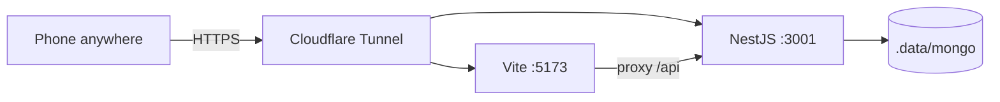

# Home PC as server (no Railway)

Run NestJS + Mongo + React on an always-on Windows PC. Reach the UI from a phone
on any network via Cloudflare Tunnel.

## Topology



Quick tunnel points at `:5173` only; Vite proxies `/api` → `:3001`.
Named tunnel (`cloudflared/config.yml`) can split `/api*` → API and `/` → web.

## One-time setup

1. `npm install` in the repo root.
2. Disable Windows Sleep / Hibernate while plugged in (Power Options).
3. Start once: `RUN_HOME_SERVER.bat` (or `powershell -File scripts\home-server\start-home-server.ps1`).
4. Autostart at logon:
   ```powershell
   powershell -File scripts\home-server\install-autostart.ps1
   ```
5. Tunnel:
   ```powershell
   powershell -File scripts\home-server\install-cloudflared.ps1
   RUN_TUNNEL.bat
   ```
   Copy the `https://….trycloudflare.com` URL to the phone. Test on **mobile data**.
6. Optional stable hostname: copy [`cloudflared/config.example.yml`](../../cloudflared/config.example.yml)
   → `cloudflared/config.yml`, create a named tunnel, then
   `powershell -File scripts\home-server\start-tunnel.ps1` (without `-Quick`).
7. Optional tunnel at logon: `install-tunnel-autostart.ps1` (prefer named config).

## Verify

```powershell
powershell -File scripts\home-server\verify-home-server.ps1 -StartScanSmoke
# After tunnel is up:
powershell -File scripts\home-server\verify-home-server.ps1 -PublicBaseUrl https://YOUR.trycloudflare.com
```

Phone checklist: Wi‑Fi off → open tunnel URL → run a scan in React.

## Streamlit → same Mongo (optional)

Streamlit can call the home Nest API instead of Yahoo:

| Where | Setting |
|-------|---------|
| Local / `.streamlit/secrets.toml` | `VOVA_API_URL = "http://127.0.0.1:3001/api"` |
| Streamlit Community Cloud secrets | `VOVA_API_URL = "https://YOUR-TUNNEL-HOST/api"` |
| Environment | `VOVA_API_URL=…` |

Client: [`vova_api_client.py`](../../vova_api_client.py). Sidebar shows **Mongo API** when set.
Charts in Streamlit may still fetch Yahoo for OHLC preview (API scan results have empty `ohlc_cache`).

## Ops

| Action | Command |
|--------|---------|
| Start | `RUN_HOME_SERVER.bat` |
| Stop | `powershell -File scripts\home-server\stop-home-server.ps1` |
| Tunnel | `RUN_TUNNEL.bat` |
| Remove autostart | `uninstall-autostart.ps1` |

Logs: `.data/home-server/logs/` (gitignored with `.data/`).

## Security

A public trycloudflare / named hostname exposes the API with **no auth** today.
Use Cloudflare Access, Tailscale, or keep the URL private. Do not post the Quick URL publicly.

## vs Railway

| | Home PC | Railway |
|--|---------|---------|
| Cost | Electricity + always-on PC | ~$9–10/mo |
| Speed | Full local CPU + Mongo cache | Smaller VMs |
| Availability | Depends on home power/ISP | Hosted SLA |
| Phone anywhere | Tunnel required | Public HTTPS by default |
