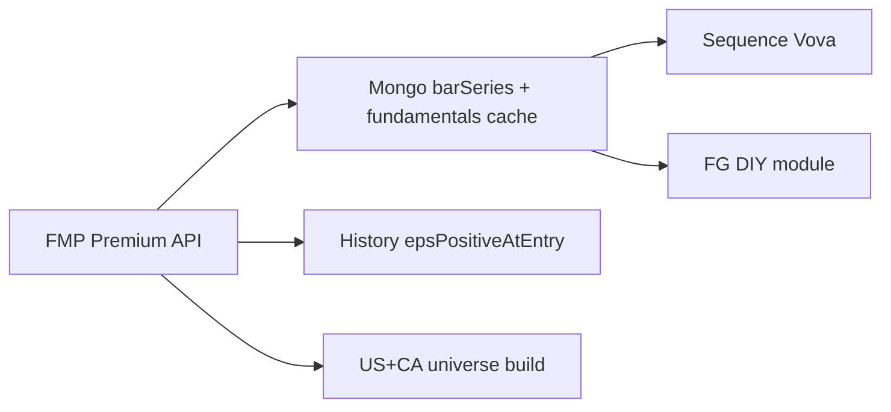

# FMP full migration + Fast Graphs DIY — saved plan

**Saved:** 2026-08-09  
**Cursor plan copy:** `.cursor/plans/finviz_vs_fast_graphs_53e8f742.plan.md`  
**Baseline commit at save time:** `fe50e89` (`main`, `FIX BACK BUTTON`)  
**Status:** research / decision plan — **not executed** yet  

**User decision:** fully migrate to FMP (EOD + fundamentals), drop yfinance as data source; build FG-like DIY module; History `epsPositiveAtEntry`; US+CA universe on FMP Premium.

**Before execute:** git tag/branch `backup/pre-fmp-…` + mongodump; need `FMP_API_KEY` on **Premium**.

---

## Todos

- [ ] `backup-pre-fmp` — git tag+branch + mongodump
- [ ] `fmp-premium-key` — FMP Premium + `FMP_API_KEY`
- [ ] `replace-yahoo-eod` — FMP `historical-price-eod` → Mongo `barSeries`
- [ ] `replace-yahoo-fundamentals` — EPS>0 / watermark from FMP
- [ ] `build-fg-module` — sidebar DIY, chart, forecast, tests
- [ ] `history-eps-at-entry` — EPS>0 at `openedAsOf`
- [ ] `universe-us-ca-fmp` — full US+CA valid list via FMP

**ETA:** MVP ~5–8 days; production ~2–3 weeks.

---

## База сравнения (ваш текущий стек)

| Сейчас | Роль | Цена |
|---|---|---|
| Yahoo / yfinance | EOD OHLC US + CA (`.TO` `.V` `.NE` `.CN`) | **$0** |
| Fast Graphs | Historical EPS / fair value / forecast UI | **~$20/мес** |
| **Итого** | TA-скринер + ручной FG | **~$20/мес** |

Критерии «может заменить»:
1. Надёжный **EOD OHLCV** (желательно US **и** Canada native).
2. Длинная **история EPS / statements / dividends** для своего FG-графика.
3. Ratios: Market Cap, EV/TEV, P/E, debt, growth, country/industry.
4. Self-serve API (без sales).
5. Цена vs ценность относительно **$20 FG + $0 Yahoo**.

Ни один retail API **не копирует 1:1** methodology Fast Graphs (adjusted operating EPS, Normal P/E, Fair Value, Est. Annual ROR). Все дают сырьё; fair value вы считаете сами.

---

## Рейтинг по цене / ценности (для вашего кейса)

Ранг = насколько хорошо закрывает **EOD US+CA + FG-like fundamentals** за разумные деньги vs текущие $20.

### 1. FMP Premium — лучший баланс (рекомендация)

- **Цена:** ~[$59/мес](https://site.financialmodelingprep.com/pricing-plans) (billed annually на сайте); Starter ~$22 только US / 5 лет.
- **EOD:** да.
- **Fundamentals:** 30+ лет statements/ratios; earnings, dividends, estimates, EV, DCF helpers.
- **Canada:** да на **Premium** (UK+Canada); Starter — нет.
- **Почему #1:** ветка `cursor/fmp-fundamentals-fastgraph-46fa`; закрывает FG-сырьё + CA.
- **Минус:** качество EPS ≠ «adjusted operating» FG; нужна валидация на тикерах вроде CPA.

### 2. Yahoo EOD ($0) + EODHD Fundamentals ($59.99)

- **EODHD Fundamentals:** [$59.99/мес](https://eodhd.com/pricing); All-In-One $99.99.
- **Canada:** `TO` / `V`; 70+ бирж.
- Лучший single-vendor global; дороже FMP All-In-One path.

### 3. Finnhub All-In-One (~$50/мес)

Хорошая цена; проверить глубину CA.

### 4. Tiingo Power ($30) + Fundamentals add-on

EOD сильный; fundamentals add-on / sales; CA fundamentals слабо.

### 5–9. SimFin, Alpha Vantage, Polygon/Massive, Finviz Elite, Intrinio

См. детали в Cursor plan; Finviz Elite **не** замена EOD+FG; Polygon без native TSX; Intrinio дорого.

### Сводная матрица (кратко)

| Vendor | ~$/мес | Fit для full US+CA + FG DIY |
|---|---|---|
| **FMP Premium** | **59** | **Выбранный путь (full FMP)** |
| EODHD All-In-One | 100 | Альтернатива one-vendor |
| Finviz Elite | 25–40 | Только US screener snapshot |
| Текущее FG+Yahoo | 20 | Дешевле, нет своего API/скриннера |

---

## Аудит FMP vs Fast Graphs (CPA) + DIY

**Вердикт:** ~85–90% UX из сырья FMP; не 1:1 FG. Нужен **Premium**.

| Метрика FG | DIY из FMP? |
|---|---|
| Market Cap, TEV, Div Yld, EPS Yld, LT Debt/Capital, Country | Да (поля / TTM) |
| Growth, Blended P/E, Normal P/E, Fair Value, Est. ROR | Да (свои формулы) |
| Operating / Adj. EPS как у FG | Приблизительно (GAAP / operatingIncome/shares / owner-earnings) |
| S&P Credit Rating | Нет |
| FG Score | Свой score, не их |

Ключевые endpoints: `income-statement`, `historical-price-eod`, `dividends`, `ratios-ttm`, `key-metrics-ttm`, `analyst-estimates`, `enterprise-values`; optional `owner-earnings`, `financial-scores`, `ratings-snapshot`.

Ветка: `origin/cursor/fmp-fundamentals-fastgraph-46fa`.

---

## yfinance paid?

**Нет.** yfinance free/unofficial. Yahoo Premium = website, not API. RapidAPI wrappers ≠ FMP. Full stack → FMP Premium.

---

## Сроки

| Цель | Срок |
|---|---|
| MVP (FMP EOD + basic FG + History EPS) | ~5–8 рабочих дней |
| Production (full US+CA, DIY, tests, Yahoo out) | ~2–3 недели |
| Polish FG UX / dual Streamlit+Nest | +1–2 недели |

---

## Backup before migrate

```bash
git tag -a backup/pre-fmp-2026-08-09 -m "Exact app before full FMP migration"
git branch backup/pre-fmp-2026-08-09
git push origin backup/pre-fmp-2026-08-09
git push origin refs/tags/backup/pre-fmp-2026-08-09
mongodump --uri="$MONGO_URI" --out=./backups/mongo-pre-fmp-2026-08-09
```

Baseline SHA note: `fe50e89` — re-check `git rev-parse HEAD` before migrate.

---

## Full FMP architecture



1. Yahoo OHLC → FMP historical-price-eod  
2. fundamentals_yahoo → FMP EPS gate  
3. FG module + DIY metrics  
4. History EPS at entry  
5. A/B then remove yfinance  

**Risks:** rate limits; CA symbol mapping; OHLC drift vs Yahoo → TA signal shifts.

---

## Feasibility (short)

1. One-shot zero mistakes — **no** (iterate).  
2. Build + test each FG function — **yes**.  
3. Accuracy vs yfinance — **will differ**; document sample.  
4. History EPS>0 at trade — **yes** via `openedAsOf`.  
5. Full US+CA valid tickers — **yes** (rebuild on FMP + cache).

---

## Execute order

1. Backup tag + mongodump  
2. FMP Premium key + FmpClient  
3. EOD replacement + A/B  
4. Universe US+CA  
5. FG module iterative  
6. History `epsPositiveAtEntry`  
7. Remove yfinance from prod  

**Blocker:** Premium `FMP_API_KEY` + explicit «execute / implement».

---

## Finviz

US-only CSV screener; not EOD backbone; not FG clone. Not chosen.
