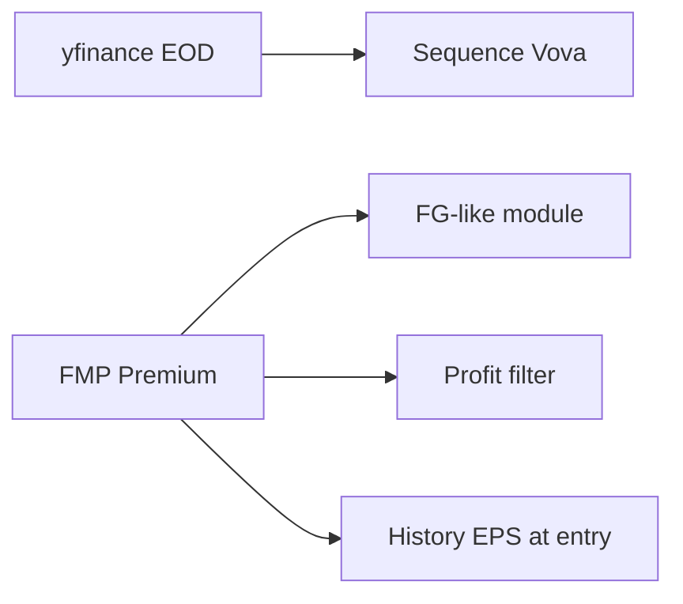

# FMP fundamentals + Fast Graphs DIY — saved plan

**Updated:** 2026-08-13  
**Cursor plan:** `.cursor/plans/finviz_vs_fast_graphs_53e8f742.plan.md`  
**Baseline commit (first save):** `fe50e89` (`main`, `FIX BACK BUTTON`)  
**Status:** executed in app (2026-08-13) — needs `FMP_API_KEY` to fetch live data

## Текущее решение (2026-08-13)

**yfinance оставляем на EOD/TA. Fast Graphs заменяем модулем на FMP.**

Полный отказ от Yahoo как источника цен **отменён**. FMP — fundamentals, FG-like график, фильтр прибыли, History EPS-at-entry.

| Слой | Источник |
|---|---|
| Sequence Vova OHLC / сканы US+CA | **yfinance / Yahoo** |
| Fundamentals, FG-view, profit filter, History EPS | **FMP Premium** (~$59; Starter мало — нет CA / 5y) |
| Fair value | своя формула PE 15 / PEG Линча |

После готовности модуля можно отменить Fast Graphs $20. Yahoo $0 остаётся.

---

## Todos

- [x] `backup-pre-fmp` — git tag+branch locally (`backup/pre-fmp-2026-08-13`); mongodump skipped (tool not installed); no push
- [ ] `fmp-premium-key` — FMP Premium + `FMP_API_KEY` in repo-root `.env`
- [x] `keep-yfinance-eod` — не трогать Yahoo OHLC / scan path
- [x] `fmp-profit-filter` — скрипт `scripts/fundamentals_fmp.py` (TTM EPS > 0); не запускали без ключа
- [ ] `rebuild-stock-tickers` — перезаписать STOCK-TICKERS.txt: `python scripts/fundamentals_fmp.py --write`
- [x] `results-card-interest` — кнопки Interested / Not Interested на карточках Results (как Chart)
- [x] `fg-module` — FmpClient + GET `/instruments/:ticker/fundamentals` + PE15/Lynch
- [x] `fg-forecasting` — Forecasting: EPS estimates, ROR, Fair Value $, future price
- [x] `fg-performance` — Performance: цена vs SPY (Yahoo) + EPS рост (FMP) + annualized 1/3/5/10Y
- [x] `fg-company-profile` — описание, sector/industry, website, country из FMP profile
- [x] `history-eps-at-entry` — POST `/history/enrich-eps` + Hide EPS≤0 + бейдж на карточке

---

## Карточки Results: Interested / Not Interested

Сейчас на графике (`ChartPage`) есть кнопки **Interested** / **Not Interested** → `api.setInterest`. На карточках Results (`SignalCard`) только бейджи INTERESTED / NO INTEREST, клик открывает график.

**Сделать:** те же две кнопки на карточке (Results и History — один `SignalCard`). Клик по кнопке не открывает график (`stopPropagation`). Toggle как на чарте: повторный клик снимает метку (`null`). Те же стили `btn-sm selected` / `danger selected`. Filter **Marked** уже есть — начнёт подхватывать метки с ленты без нового API.

**ETA:** MVP ~3–6 рабочих дней; production ~1–2 недели (EOD не мигрируем). Rebuild вселенной + чистка History — в том же окне, не отдельный месяц.

---

## Неверный STOCK-TICKERS.txt и History: решит ли FMP?

Сейчас в [`STOCK-TICKERS.txt`](STOCK-TICKERS.txt) **2803** строки. Фильтр EPS>0 уже задуман (`fundamentals_yahoo.py` → Yahoo `.info` `trailingEps > 0`), но на практике список **грязный**: CEF/трасты в файле, Yahoo часто отдаёт пустой/устаревший EPS или падает на 429 — тикеры проскакивают без прибыли. Сканы пишут History по этой вселенной → **исторические сделки на «не тех» именах**.

### Сэкономит ли время vs ручной фильтр?

| Способ | На 2800 тикеров | Итог |
|---|---|---|
| Вручную в Fast Graphs / Yahoo | ~1–2 мин/тикер → **40–90 часов** | нереально поддерживать |
| Снова Yahoo `.info` | часы–сутки + те же дыры | уже не сработало |
| **FMP TTM EPS / screener / bulk** | **минуты–пара часов** на полный проход + кэш | да, это смысл FMP |

Экономия: не десятки часов кликов, а один rebuild вселенной. Дальше фильтр прибыльных — ночной/по расписанию, не руками.

### Что FMP **решит**

- Пересобрать список: только EQUITY + **TTM EPS > 0** (или netIncome > 0) из statements, не из дырявого `.info`
- Убрать фонды/трасты надёжнее (quote type / industry)
- Новые сканы Sequence Vova — только по чистой вселенной
- History: пометить `epsPositiveAtEntry` на дату входа

### Что FMP **не** решит само

- Уже записанные `trackedSignals` **не исправятся** от подключения API. Старые сделки на убыточных тикерах останутся в Mongo, пока не отфильтруем/не пересоберём History после нового списка.
- EOD «валидный тикер» по-прежнему Yahoo (как договорились). FMP чистит **прибыль**, не магию OHLC.

**Нужный порядок:** FMP EPS-gate → перезаписать `STOCK-TICKERS.txt` → новые сканы → History: скрыть/пометить сделки, у которых EPS≤0 на `openedAsOf` (и опционально тикер больше не в списке).

---

## Fair value: PE 15 или PEG Питера Линча

Рост = **5-year EPS CAGR** из FMP `income-statement` (annual). Годы с EPS ≤ 0 в CAGR не входят. Мало точек → growth N/A, fair-value линии нет.

Правило (совпадает с логикой ваших скринов FG: NVDA growth 63.47% → FV 63.47x; ADBE 16.39% → 16.39x):

- `growthRate < 15%` → **Fair Value Ratio = 15x**
- `growthRate >= 15%` → **Fair Value Ratio = growthRate** (PEG = 1, Питер Линч: справедливый P/E = темп роста в %)

Fair value price = `EPS × FairValueRatio`.

**Normal P/E** — отдельная метрика: среднее `yearEndPrice / annualEPS` (EPS > 0), не fair value.

---

## Все метрики (сайдбар FG)

| Метрика | FMP / расчёт |
|---|---|
| Growth Rate | 5y EPS CAGR |
| Fair Value Ratio | 15x или Lynch (выше) |
| Normal P/E | среднее historical PE |
| Blended P/E | `(PE_TTM + Price/EPS_fwd) / 2` |
| EPS Yld | `earningsYieldTTM` или EPS/Price |
| Div Yld | `dividendYieldTTM` |
| S&P Credit Rating | **нет в FMP** → «—» |
| Market Cap | `profile.marketCap` |
| TEV | `enterprise-values` / `enterpriseValueTTM` |
| LT Debt/Capital | `longTermDebtToCapitalRatioTTM` |
| Country | `profile.country` |
| Industry | `profile.industry` (не официальный GICS) |
| Est. Annual ROR | DivYld + growth + reversion к FairValueRatio |

Сайдбар **обязан** показывать этот набор (пример TSM-подобных значений): Blended P/E, EPS Yld, Div Yld, S&P Credit Rating, Market Cap, TEV, LT Debt/Capital, Country, GICS Sub-industry. Плюс сверху Growth / Fair Value Ratio / Normal P/E.

- **Есть из FMP:** Blended P/E (считаем), EPS Yld, Div Yld, Market Cap, TEV, LT Debt/Capital, Country, industry.
- **Нет в FMP:** S&P Credit Rating (AA−) → всегда «—», пока нет другого источника. GICS — подпись industry FMP, не код MSCI/S&P.
| FY EPS / %Chg / Div | income-statement + dividends |
| Price на FG-графике | Yahoo bars из существующего кэша |

Endpoints: `income-statement`, `dividends`, `ratios-ttm`, `key-metrics-ttm`, `analyst-estimates`, `enterprise-values`, `profile`; optional `owner-earnings`, `financial-scores`.

Ветка-заготовка: `origin/cursor/fmp-fundamentals-fastgraph-46fa`.

---

## FMP эффективнее Yahoo для прибыльных?

**Да.** Сейчас `scripts/fundamentals_yahoo.py` дергает `yf.Ticker.info` / `trailingEps > 0` по одному тикеру — медленно и ломается на 429. FMP отдаёт TTM EPS / net income / screener / bulk key-metrics: один проход по вселенной вместо тысяч `.info`. OHLC-валидность тикера по-прежнему Yahoo (`ohlc_yahoo.py`). Только EPS-gate переносим на FMP.

## FMP точнее yfinance по fundamentals?

**Да, обычно.** FMP: statements из filings, стабильные TTM ratios, estimates. yfinance `.info`: scrape, дыры, устаревший PE. Для **цен баров TA** Yahoo оставляем — иначе сдвинутся сигналы Sequence Vova. FMP ≠ Fast Graphs 1:1 (GAAP vs adjusted operating EPS).

---

## Архитектура



---

## Backup перед работой

```bash
git tag -a backup/pre-fmp-2026-08-13 -m "App before FMP fundamentals module"
git branch backup/pre-fmp-2026-08-13
git push origin backup/pre-fmp-2026-08-13
git push origin refs/tags/backup/pre-fmp-2026-08-13
mongodump --uri="$MONGO_URI" --out=./backups/mongo-pre-fmp-2026-08-13
```

---

## Порядок execute

1. Backup tag + mongodump  
2. FMP Premium key  
3. Profit filter на FMP (Yahoo OHLC universe без изменений)  
4. FG module: метрики + график + PE15/Lynch  
5. History `epsPositiveAtEntry`  
6. Отменить Fast Graphs $20 после spot-check (NVDA, ADBE, CPA)

**Блокер:** `FMP_API_KEY` на Premium + явное execute.

---

## Будет ли график как FAST Graphs (NVDA / ADBE)?

**Похожий по структуре — да. Клон UI Fast Graphs — нет.**

Будет: Price (белая), Fair Value (оранжевая, 15x или PEG=1), Normal P/E (синяя), заливка EPS + дивиденды, таблица FY EPS/Chg/Div, сайдбар метрик, 5Y/10Y/MAX.

Не будет 1:1: GAAP EPS ≠ FG operating → другие высоты линий; нет FG Score и S&P rating; первая версия без всех тумблеров FG. Это экран в вашем приложении с той же логикой оценки.

## Company profile, Forecasting, Performance

Да, эти экраны входят в модуль (вкладки рядом с Summary).

**Forecasting v1:** график forward EPS + таблица EPS/Chg/Div/#analysts; ROR; Fair Value $; Future Stock Price. Без pie Analyst Scorecard FG.

**Performance v1:** цена vs SPY (Yahoo) + EPS % компании (FMP) + annualized 1/3/5/10Y. Без линии SPY EPS.

**Company profile v1:** FMP description, country, sector, industry, website. Не полное дерево GICS S&P.

---

## Finviz / полный отказ от yfinance

Finviz Elite не берём. Полный переход EOD на FMP **не делаем** (решение от 2026-08-13).
