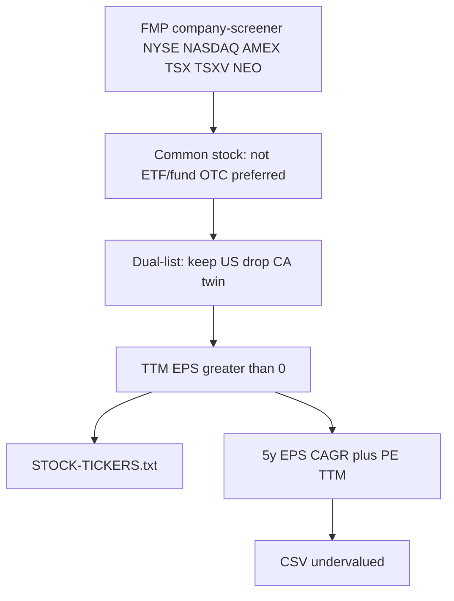

# Рескан US+CA через FMP: EPS>0 и фильтр PE/PEG

**Updated:** 2026-08-14  
**Cursor plan:** `.cursor/plans/fmp_universe_pe_peg_9731567b.plan.md`

Yahoo остаётся только для Sequence Vova (OHLC). Источник тикеров и фундаменталов — FMP.

Скрипт: `python scripts/build_universe_fmp.py` (dry-run) и `--write` для `STOCK-TICKERS.txt`.  
Premium FMP: **750 HTTP/мин**; клиент держит **12 запросов/с (720/мин)**.

## Правила отбора

- **Вселенная файла:** common stock, US+CA major exchanges, активно торгуется, не ETF/fund, **TTM EPS > 0**.
- **Рост:** тот же **5y EPS CAGR**, что в `packages/engine/src/fundamentalsValuation.ts` (годы с EPS ≤ 0 не входят). Пороги: GDF &lt; 5%, GDF…P/E=G 5–15%, P/E=G ≥ 15%. Если календарный спан CAGR &lt; 2 года — не Lynch, правило `gdf_pe_g` (15×).
- **Недооцененные (CSV, файл вселенной не сужаем):**
  - `gdf` / `gdf_pe_g` (в т.ч. короткий спан) → `peTTM < 15` (и PE > 0)
  - `pe_g` → Lynch **PEG = peTTM / growthRate < 1**
  - рост N/A → в CSV недооцененных не попадает, в `STOCK-TICKERS.txt` остаётся, если EPS>0

## Выходы

- `--write` → `STOCK-TICKERS.txt` (все EPS>0 common stocks)
- CSV → `reports/undervalued-pe-peg.csv`: yahoo, tv, name, exchange, epsTtm, peTtm, growth5y, rule (`gdf` / `gdf_pe_g` / `pe_g`), pegLynch, pass
  (legacy cache may still show `pe15` / `lynch_peg`)

Yahoo OHLC-валидацию скрипт не делает. Старый `scripts/build_full_us_tsx_ohlc_list.py` не удалять.
